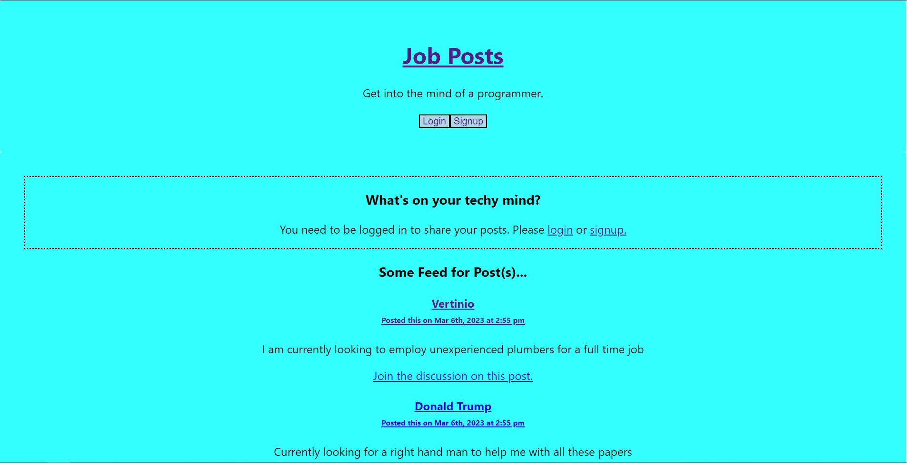

# Project-3

NoMoreSeek is a cross between a social media site and a job seeking site. It helps users link with employers and employees
to find employment.

Deployed URL of the application: https://no-more-seek.herokuapp.com/

## Table of Contents

- [Installation](#installation)
- [Usage](#usage)
- [Credits](#credits)
- [License](#license)

## Installation

- Navigate to the main folder's package.json file
- There you will see all the dependencies
- To install them make sure you are navigated to the main folder and run "npm i"

## Usage

- Run npm run seed to seed the application
- Run npm run develop to start the applicaiton
- Browse through all the already existing posts
- Sign up as a new user and post away.

## Credits

N/A

## Licence

Please refer to the repo
